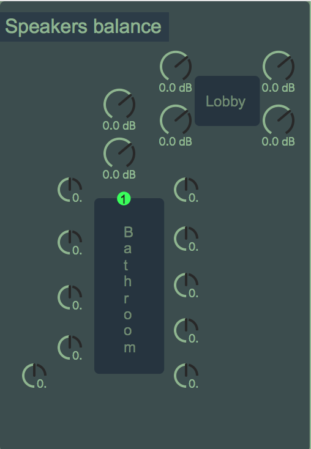
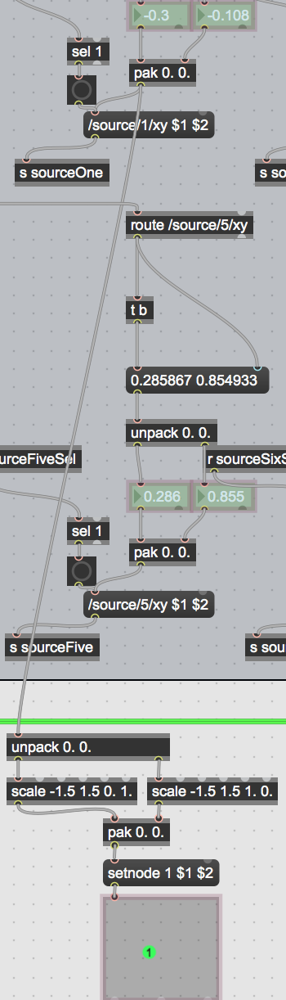
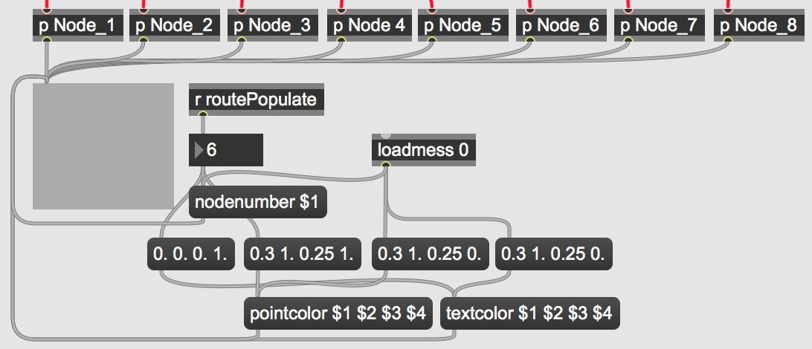

# RADAR Sophia Sagaradze MOD

To open patch properly you need to download SPAT5 from IRCAM ( it’s free) https://forum.ircam.fr/projects/detail/spat/

you can write me by the mail sopo.sagaradze@gmail.com

I am also available on Instagram: sophiasagaradze or on Facebook. 
Feel free to improve the patch and get crazy. This is just the beginning. 
Bests! 

## LOG 06062021

- designing and implementation of custom viewer that replaces the CPU intensive viewer of Spat5 with a viewer based on the Node objekt
- 

- 
- The number of Nodes should represent the number af active channels in the patch, this was dont by using the "r routePopulate" which tells how many samples is loaded into the patch.
- 

- to make it more dynamic when the patch is loaded no nodes are shown, but as soon as samples are loaded the corresponding number of nodes will show in the custom viewer.